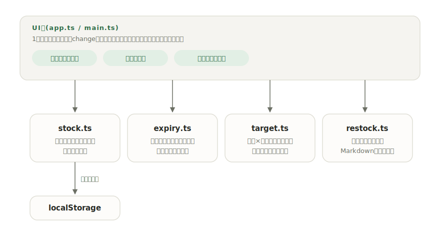

# sonae

[](https://github.com/miruky/sonae/actions/workflows/ci.yml)
[](https://github.com/miruky/sonae/actions/workflows/deploy.yml)

[](LICENSE)

**防災備蓄の台帳。賞味期限と点検時期を見張り、家庭の備蓄目標との差を買い足しリストにするアプリ。**

公開ページ: https://miruky.github.io/sonae/

## 概要

sonaeは家庭の防災備蓄を1つの台帳で管理するツールである。水や非常食には賞味期限を、救急セットや懐中電灯のような期限のない用具には最終点検日を記録すると、台帳が常に「急ぐ順」に並び、期限切れ・期限間近(30日以内)・要点検(点検から180日)が一目で分かる。世帯の人数と備える日数を設定すれば、飲料水と食料の必要量に対する充足率が出て、足りない分は要対応の品目とまとめてMarkdownの買い足しリストになる。画面上部の概況には登録品目数・要対応件数・次に切れる期限をまとめている。

並べ替え(急ぐ順・期限順・品名順・カテゴリ順)とカテゴリ・要対応での絞り込みに対応し、テーマ(自動・ライト・ダーク)は切り替えて記憶する。台帳はJSONで書き出し・読み込みでき、別端末の控えを読み込んでも手元の品目はidで突き合わせて残る。削除は数秒のあいだ取り消せる。

データはブラウザのlocalStorageに保存され、サーバーには何も送らない。外部ライブラリを実行時に読み込まないため、一度開けばオフラインでも動く(マストヘッドの写真を除く)。

### なぜ作ったのか

防災備蓄は「買って満足」で止まりやすく、いざ点検すると水が期限切れ、モバイルバッテリーは放電している、ということが起きる。期限の管理だけなら表計算でもできるが、「期限のない用具の点検時期」「家族の人数に対して何が足りないか」までは式を組まないと見えない。備蓄の鮮度と量の両方を、開いた瞬間に判断できる形にしたかった。

## アーキテクチャ



UI層はフレームワークなしのTypeScriptで、1画面の台帳を状態が変わるたびに描き直す。期限の判定、目標量の計算、買い足しリストの生成は「今日」を引数に取る純粋なモジュールで、DOMに依存せずそのまま単体テストできる。

## 技術スタック

| カテゴリ             | 技術                           |
| :------------------- | :----------------------------- |
| 言語                 | TypeScript 5(strict)           |
| ビルド               | Vite 8                         |
| テスト               | Vitest 4                       |
| リンタ・フォーマッタ | ESLint 9 / Prettier            |
| CI / 配信            | GitHub Actions / GitHub Pages  |
| 永続化               | localStorage(外部サービスなし) |

## 使い方

### 品目の状態

| 状態     | 条件                                  |
| :------- | :------------------------------------ |
| 期限切れ | 賞味期限が今日より前                  |
| 期限間近 | 賞味期限まで30日以内                  |
| 期限内   | 賞味期限まで30日より先                |
| 要点検   | 期限なしの品で、最終点検から180日以上 |
| 点検済み | 期限なしの品で、最終点検から180日未満 |

期限のない品(用具)は行の「点検した」ボタンで最終点検日を今日に更新する。

### 備蓄目標と充足率

人数と日数を設定すると、農林水産省の家庭備蓄の目安にならって必要量を計算する。

- 飲料水: 1人1日3L。カテゴリ「水」で単位がL(l・リットルも可)の品目を合算する。
- 食料: 1人1日3食。カテゴリ「食料」で単位が食(食分も可)の品目を合算する。

期限切れの品は充足量に数えない。2人×3日なら水18L・食料18食が目標になる。

### 並べ替えと絞り込み

備蓄品は「急ぐ順」を既定に、期限の近い順・品名順・カテゴリ順へ並べ替えられる。期限のない用具は期限順では末尾にまとめる。カテゴリでの絞り込みと「要対応のみ」の絞り込みは並べ替えと併用できる。

### バックアップ(書き出し・読み込み)

ヘッダーの「書き出し」で台帳全体を整形済みJSONとして保存し、「読み込み」で取り込む。読み込みは置き換えではなく統合で、品目はidで突き合わせて同じidは取り込み側で上書きし、手元にしかない品目は残す。世帯設定は取り込み側を採用する。別の端末やバックアップから戻すときに使う。

### テーマ

ヘッダーのテーマボタンで自動・ライト・ダークを巡回する。選択はlocalStorageに記憶し、次回は描画前に適用するのでちらつかない。自動のときはOSの配色設定に従う。

### キーボード

| キー  | 動作                       |
| :---- | :------------------------- |
| `N`   | 追加欄へ移動               |
| `T`   | テーマを切り替える         |
| `Z`   | 直前の削除を取り消す       |
| `Esc` | 入力欄からフォーカスを外す |

### 買い足しリスト

「買い足しリストをコピー」で、要対応の品目と目標への不足分をチェックボックス付きMarkdownにする。削除した品目は数秒のあいだ「元に戻す」で復元できる。

```markdown
# 買い足しリスト

- [ ] さばの缶詰 6食(期限間近・あと21日)
- [ ] 救急セット 1式(要点検・点検から200日)
- [ ] 飲料水 あと6L(目標18L)
- [ ] 非常食 あと8食(目標18食)
```

### 制約

- 充足率の集計は単位の一致が前提になる。水を「本」で登録すると目標(L)には数えられない。
- リマインドは画面を開いたときの表示であり、プッシュ通知は送らない。
- データは端末のブラウザに保存されるため、端末をまたいだ同期はできない。

## プロジェクト構成

- `index.html` — エントリポイント
- `src/main.ts` — 起動。ストアの初期化と初回の見本データ投入
- `src/app.ts` — 台帳画面の描画とイベント処理
- `src/icons.ts` — 線画SVGアイコン
- `src/style.css` — デザイントークンとスタイル(ライト・ダーク対応)
- `src/lib/stock.ts` — 品目と世帯設定の型・検証・永続化・統合(import)
- `src/lib/expiry.ts` — 期限・点検時期の判定と急ぐ順の並べ替え
- `src/lib/target.ts` — 備蓄目標の計算と充足率
- `src/lib/restock.ts` — 買い足しリストのMarkdown生成
- `src/lib/overview.ts` — 概況(状態別件数・次に切れる期限)の集計
- `src/lib/sort.ts` — 並べ替えモード(急ぐ順・期限・品名・カテゴリ)
- `src/lib/theme.ts` — テーマの解決と永続化
- `src/lib/seed.ts` — 初回起動時の見本データ
- `docs/architecture.svg` — 構成図
- `.github/workflows/` — CI(lint・テスト・ビルド)とPagesデプロイ

## はじめ方

### 前提条件

- Node.js 22以上

### セットアップ

```bash
git clone https://github.com/miruky/sonae.git
cd sonae
npm install
npm run dev
```

### テストの実行

```bash
npm test
```

### Lintの実行

```bash
npm run lint
```

### ビルド

```bash
npm run build
```

GitHub Pagesではリポジトリ名のサブパスで配信されるため、デプロイ時は環境変数 `SONAE_BASE=/sonae/` でViteの `base` を切り替える(`.github/workflows/deploy.yml` 参照)。

## 設計方針

- **開いた瞬間に判断できる台帳** — 並び順そのものを情報にする。品目は常に「期限切れ、期限間近、要点検、それ以外」の順に保たれ、探さなくても上から対応すればよい。
- **「今日」を引数に取る純粋関数** — 期限判定・集計・リスト生成は現在時刻を内部で参照せず、すべて引数で受け取る。テストが日付に依存せず、判定の境界(ちょうど30日・180日)を確実に検証できる。
- **量より先に鮮度を疑う** — 充足率は期限切れを除いて数える。「水は18Lあるが半分は期限切れ」という状態を、満たされているように見せない。
- **入力は寛容に、保存は厳密に** — 単位の表記ゆれ(l・リットル・食分)は集計時に吸収し、保存データの復元は型ガードで検証して壊れた要素だけを読み飛ばす。読み込み(import)も同じ検証を通すため、壊れたバックアップで台帳が崩れない。
- **箱ではなく罫線と余白で構成する** — 厚いカードや影を重ねず、1px罫線・余白・タイポ階層で情報を分ける。見出しは明朝、本文はゴシックで階層を作り、数値はタブ等幅で桁を揃える。配色は紙色のベースに深緑のアクセント1色で、ライト・ダークそれぞれに合わせて罫線とアクセントを調整する。
- **動きは初回だけ、止められる** — 数値のカウントアップ・充足バーの伸び・出現は最初の描画でのみ走らせ、編集のたびに再生しない。`prefers-reduced-motion: reduce` ではすべて無効化する。
- **実行時の依存を持たない** — UIも判定ロジックも素のTypeScriptで書き、実行時にライブラリを読み込まない。配信物が小さく、写真以外はオフラインで動く。

## ライセンス

[MIT](LICENSE)
